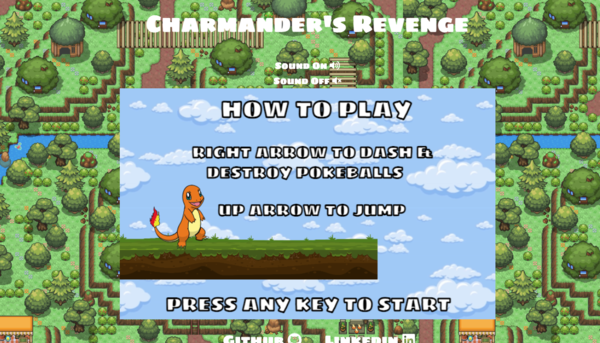

# Welcome to Charmander's Revenge 

[Live Game](https://isabelleshafran.github.io/CharmandersRevenge/)

## Instructions 

* Right arrow to dash and destroy pokeballs 
* Up arrow to jump 




## Demo 


Logic to Increase Speed of Pokeballs and Generate New Pokeballs: 

```
  moveBalls(score) {
    this.eachBall(function (ball) {
       if (score >= 2) {
         this.speed = 4.5;
       } 
       if(score >= 5) {
         this.speed = 5.5 
       }
       if(score > 9) {
         this.speed = 7
       }
       if (score > 15) {
         this.speed = 8.5;
       }
      ball.left -= this.speed;
      ball.right -= this.speed;
    });
    
    if (this.balls[0].right <= 0) {
      this.balls.shift();
      let newB;
      if(score < 5){
        newB = this.balls[1].left + CONSTANTS.BALL_SPACING;
      }

      if(score >= 5) {
        newB = this.balls[1].left + 500;
      }
      this.balls.push(this.randomBall(newB));
    }
  }
  ```


Logic for Jumping & Dashing: 

game.js for key events - 

```
  click(e) {
    if (e.keyCode === 38) {
      this.charmander.jump();
    }

    if (e.keyCode === 39) {
      this.charmander.dash();
    }
  }
```

charmander.js - 
```
  jump() {
    let i = 0;
    while (i < CONSTANTS.JUMP_SPEED) {
      this.vel = -1 * i;
      i += 1;
    }
  }

  dash() {
    if(this.dashing === false) {
      this.dashing = true;
      let i = 50;
  
      while (i < CONSTANTS.DASH_SPEED) {
        this.x = i;
        i += 1;
      }
    }
  }
```